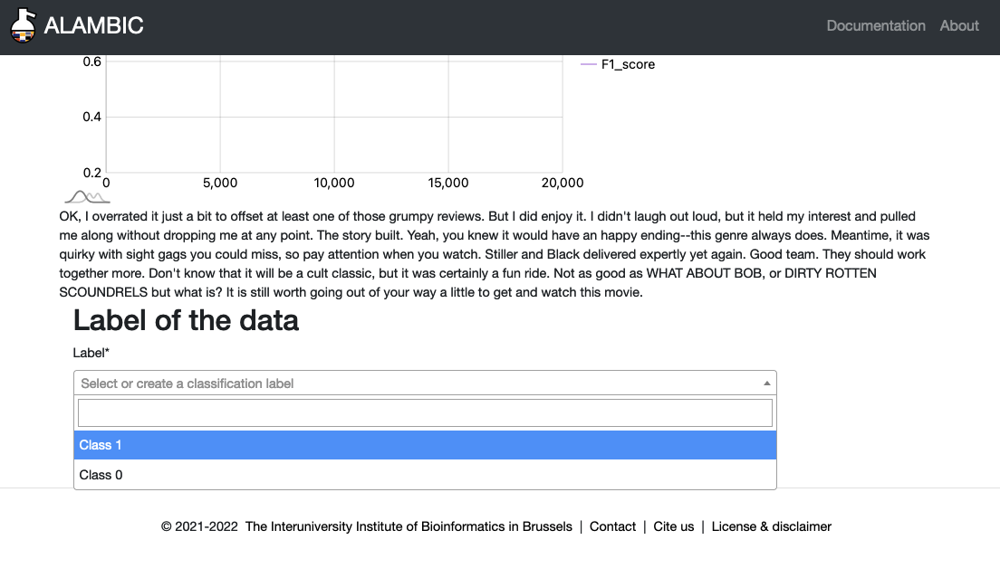

During the development of a model using active learning, the model will select the most interesting query it wants to know the label of. If that label is available, you won't have to do anything. However, if the label is not available (which is more than likely if you want to use active learning), you will have to annotate.

Below you can find the different available annotation.

# Classification
You just have to select below in the dropdown the class corresponding to the data shown on the page.

