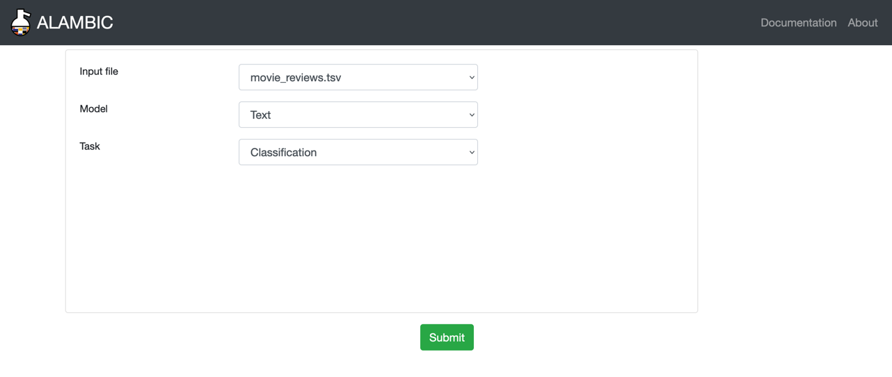

  

    Table of contents
  

  {: .text-delta }
1. TOC
{:toc}

# Overview
The import of data in the database depends on the type of the data and the task we want the model to execute afterwards. Everything will be uploaded according to a `.tsv` file with a specific format which will be further explained in the following sections.

To import the data, from the home page click on `Upload data` on the upper left corner or got directly to <a href="http://0.0.0.0:8000/upload" target="_blank">http://0.0.0.0:8000/upload</a>

{: .text-center }

On the Upload page, you can select the task and the type of data you manage. You also have to select in the dropdown menu the `.tsv` file with the desired format which will be use for the import.

Important
 All the data you want to upload MUST BE in the `data_alambic` folder before you build the docker-compose and mount the volumes ! 

# Classification
## For text & 2D images
{: .no_toc }

The `.tsv` file has two columns, named `file` and `label`, with a line for each sample such as :

| file | label |
|:---:|:---:|
| relative path where the file is situated with `data_alambic` as the working directory | class label of the data |

<h1>Relation Extraction 
Coming soon
</h1>