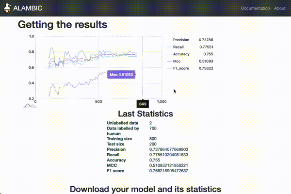
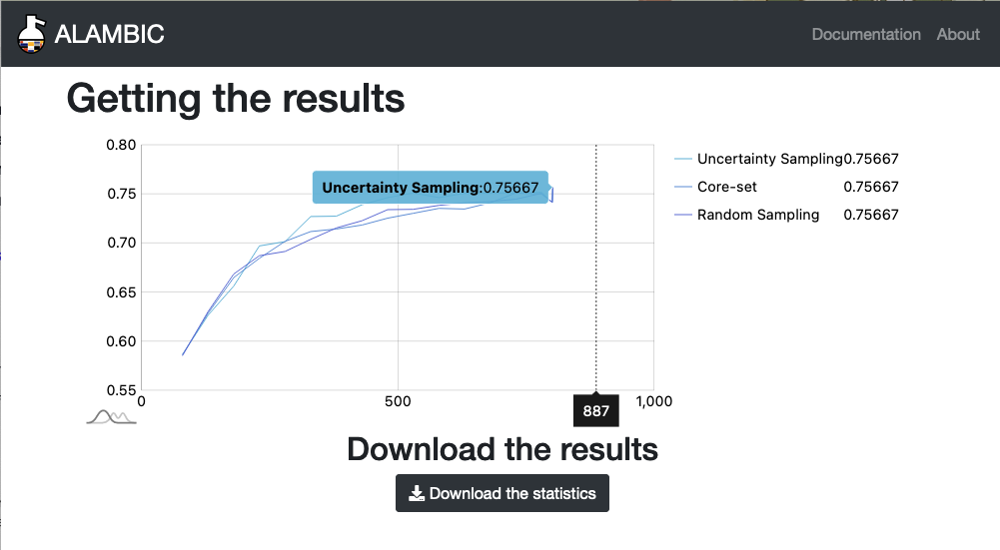

# For a model training

{: .text-center }

In the results page, you will find the chart plotting the metrics of your model according to the number of queries you have labelled.

You will also be able to download :
- The model in a `.gz` format, 
- The metrics used to plot the above chart,
- The data with its original labels from the import, the labels obtained during the active learning process and the predictions done by the model.

# For an analysis

{: .text-center }

For the analysis, you will have the chart of the average results obtained during the different folds and repeats of the analysis, one line for each query strategy.

You can only download the metrics obtained during the analysis.