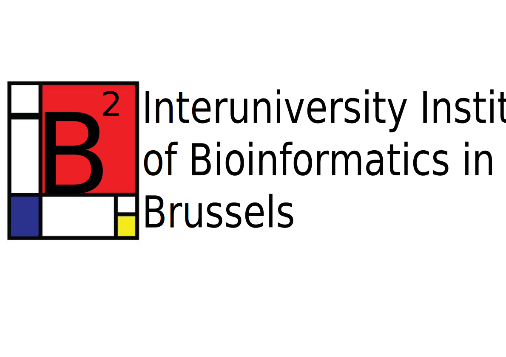

# License
This work is under a BSD-3-Clause license.

# Main Libraries used
- Django
- scikit-learn : Scikit-learn: Machine Learning in Python, Pedregosa et al., JMLR 12, pp. 2825-2830, 2011.
- Celery (and django-celery)
- Alipy : ALiPy: Active learning in python. Tang, Y.-P.; Li, G.-X.; and Huang, S.-J. Technical report, Nanjing University of Aeronautics and Astronautics, 2019. Available as arXiv preprint https://arxiv.org/abs/1901.03802.

# Funding
This project was realised at the Interuniversity Institute of Bioinformatics in Brussels ([IB2](https://ibsquare.be)), a collaborative bioinformatics research initiative between Université Libre de Bruxelles (ULB) and Vrije Universiteit Brussel (VUB). Basic architecture and design was largely inspired by the work done by Alexandre Renaux for [ORVAL](https://orval.ibsquare.be). This work was supported by Service Public de Wallonie Recherche under grant n° 2010235 - ARIAC by DIGITALWALLONIA4.AI.
<table>
<tr>
<td style="text-align: center;"></td><td style="text-align: center;"></td>
</tr>
<tr><td style="text-align: center;"></td></tr>
</table>

# Cite us
If you used our tool (and liked it), please cite us with :


Nachtegael, C. (2022). ALAMBIC (Version 0.1) [Computer software]. https://doi.org/TBA


or in the format Bibtex : 


@software{Nachtegael_ALAMBIC_2022,
author = {Nachtegael, Charlotte},
doi = {TBA},
month = {6},
title = {ALAMBIC},
url = {https://github.com/Trusted-AI-Labs/ALAMBIC},
version = {0.1},
year = {2022}
}

