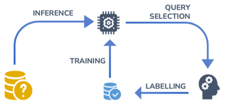

# General Overview

ALAMBIC, or **A**{: .fs-5 }ctive **L**{: .fs-5 }earning **A**{: .fs-5 }utomation with **M**{: .fs-5 }ethods to **B**{:
.fs-5 }attle **I**{: .fs-5 }nefficient **C**{: .fs-5 }uration, is an open-source Dockerized web platform for the study
and development of machine learning models with the help of active learning.

## What is Active Learning ?

{: .text-center }

Active learning is used when we have only a portion of the total data labelled and the labelling of the data is time-
and/or cost-sensitive. This method optimizes the labelling of the data by selecting the "most interesting" samples to be
labelled.

The model, here called the **learner**, will be initially trained only with that labelled data. Then, it will try to
predict/infer the labels of the unlabelled data. With these predictions, the learner will select the sample, also called
the **query**, it is the most interested to learn the true label of. This process is called the **query selection** and
can be done according to different strategies, such as choosing the query the most representative of a population of
queries or the query for which the learner is the most uncertain of its prediction.

The query is then presented to an **oracle**, most of the time a human, who will label the query. Following this, the
newly labelled query is added to the labelled pool and the process of training can begin anew.

The loop of training-inference-selection-labelling is repeated until a specific criterion is reached, such as a
labelling cost (i.e., a maximum number of labels done by the oracle) or a minimum performance goal (i.e., the accuracy
of the learner). By doing so, one can reach a decent performance for a machine learning model while labelling at the
same time their data. (Thank you, active learning !)

## What does ALAMBIC do ?

ALAMBIC offers a platform where the whole active learning process is fully implemented with little to no-code to do !

You just have to :

1. Import the data (labelled and/or unlabelled)
2. Choose your model, its settings and the features you want to use
3. Choose if you want to train a model with active learning or study the active learning process, with their respective
   settings
4. Launch !

The process is automated with visualisations to track the performance of the learner. You just need to be there to play
the oracle when your data has to be labelled !